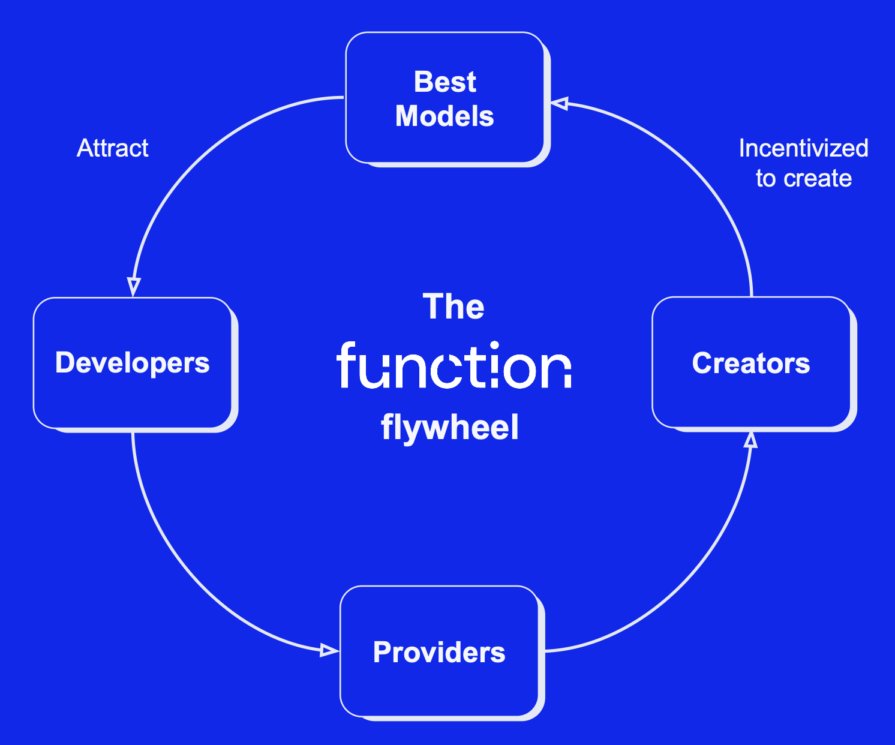

# About Function

Function Network is **designed to democratize AI inference**, providing **scalability, transparency, and decentralized rewards** for all participants.

## The Problem: Open Source AI Isn’t Accessible for All  
- **Zero Income for Model Creators**  
  Popular open-source models see millions of downloads but creators earn \$0 in royalties.  
- **High Infrastructure Costs**  
  Creators or end-users must build complex SaaS platforms or rent GPUs from centralized marketplaces, often at unsustainable prices.  
- **Poor Discovery & Incentives**  
  No clear onchain incentive structure means community-driven innovation and usage remain limited.  

## Our Solution: Democratize AI with Function Network  

1. **Model Discovery**  
   A searchable marketplace for open-source models, making it easy for developers to find and integrate the best AI.  
2. **Scalable Hosting**  
   Sharded, distributed inference across diverse GPU providers (from RTX 3090s to datacenter fleets) lowers costs and boosts performance.  
3. **Fully Managed**  
   End-to-end infrastructure, SLA-backed by onchain enforcement. No DevOps overhead for creators or consumers.  
4. **Onchain Monetization**  
   Automated royalty payments and usage fees settled in FUNC tokens, so creators, providers, and developers all earn their fair share.  

## Incentive Alignment: How the Network Works  
FUNC tokens power every interaction onchain:

- **Portals (Developers)**  
  Deposit FUNC to purchase inference throughput.  
- **Compute Providers**  
  Stake resources, host models, and earn FUNC for each inference served.  
- **Model Creators**  
  Automatically receive a cut of the FUNC paid by providers, turning downloads into recurring revenue.  
- **Smart Contracts**  
  Coordinate deposits, payments, and royalties with instant settlement and full transparency. 

## The Function Flywheel  

